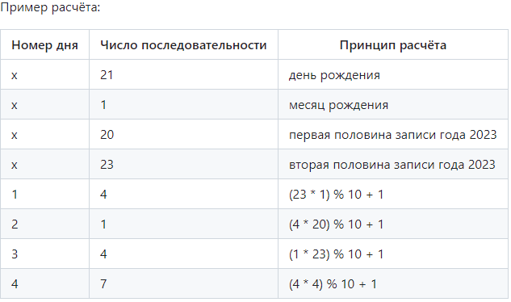

### "Рекурсия"

Один любознательный студент завёл себе слишком много хобби - аж 10 штук. Т.к. он любил их всех, он никогда не 
мог определиться, каким хобби он будет заниматься сегодня.

И он придумал правило, по которому будет выбирать себе хобби.

В самом начале он пишет два числа: день и месяц своего рождения, затем два числа - две половинки текущего 
года. Например, если он родился 21го января и на дворе 2023й год, то первые четыре числа получаются 21 1 20 23.

Каждое следующее число получается по правилу: берётся предыдущий день и за два дня до него, перемножаются, 
берётся остаток от деления на 10, затем прибавляется 1, чтобы была нумерация с единицы. Каждое такое число 
будет от 1 до 10 и являться номером хобби, которым он будет заниматься в этот день.

